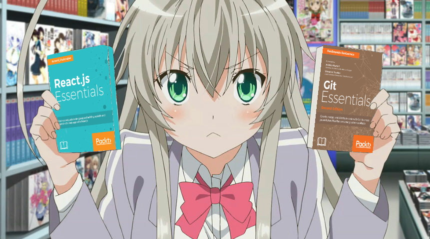

<h1>Welcome to My Reading Diary ^^</h1>
  

Here, you'll find a list of books, courses, and other materials I've read or watched, along with my personal notes and summaries. These are my interpretations, so be sure to check out the original sources for complete details.

## What's Inside?

- [Books](/books/books_list.md): A list of books I've read, with notes on some of them.
- [Courses](/courses/my_courses.md): A list of courses I've taken, including my notes, solutions, and resources.
- [Reading List 2024](/reading-list/2024.md): A collection of things I've read or watched, updated over time.

## Usage

Feel free to use these notes for your personal reference. If you find them helpful, please consider giving this repository a star. If you have any suggestions or corrections, you're welcome to submit a pull request.

## Disclaimer

These notes are personal interpretations and summaries. They may not cover all aspects of the materials. For a complete understanding, please refer to the original sources.
