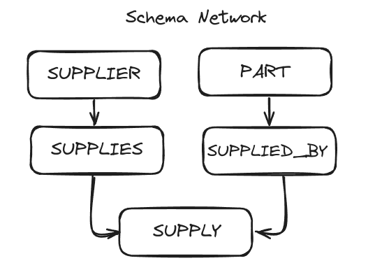
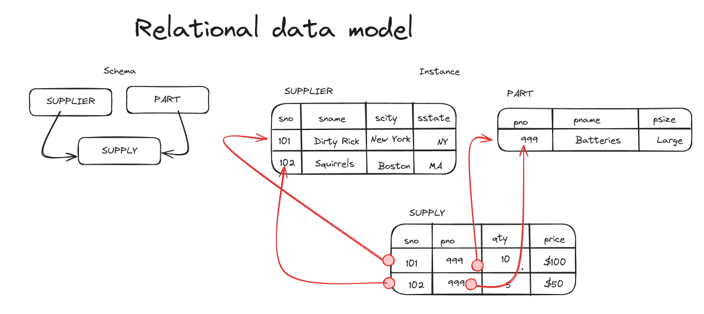
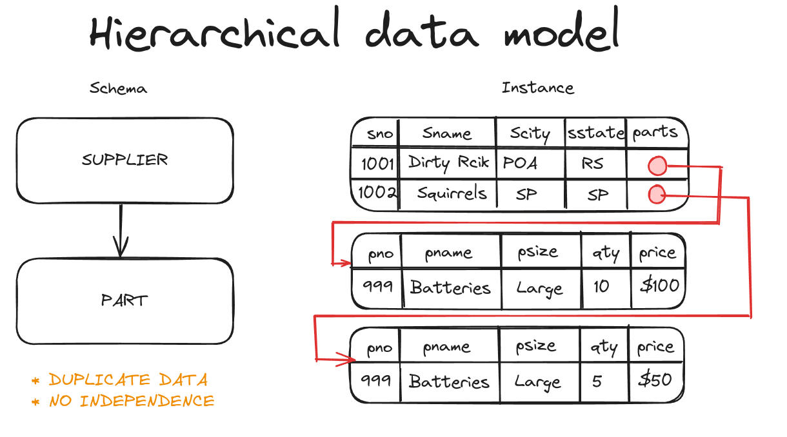
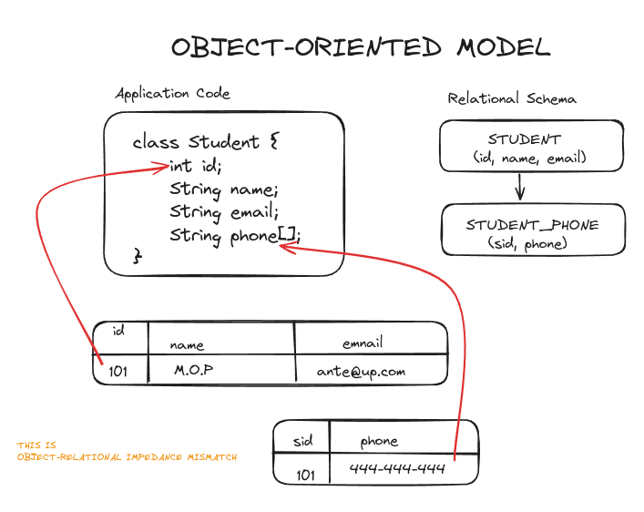
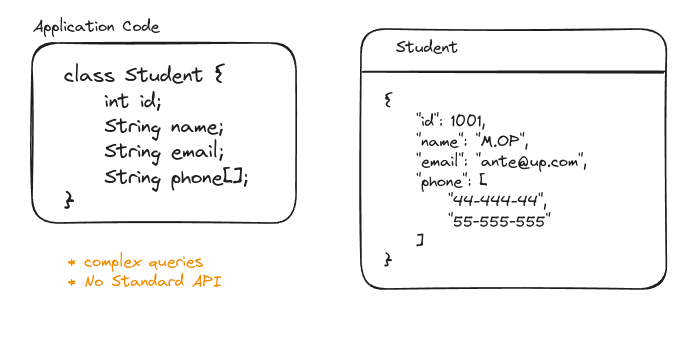

# History of Databases

Basically, all the old database issues are still the same in today's debate. The SQL vs. NoSQL debate is reminiscent of the Relational vs. CODASYL debate from the 1970s.

**1960 - Integrated Data Store (IDS)**: Theyre going to use what is caled a network data modelling and when youre execute queries is basically be writing a bunch of for loops that operate on a single tuple at a time and was one of the frist DBMSs

**CODASYL**: COBOL people got together and proposed a standard for ow programs will access a database. Lead by [Charles Bachman](). Network data model but a Tuple-at-time queries during query executing.

**Network Data Model**: The network data model is a database model conceived as a flexible way of representing objects and their relationships. Its distinguishing feature is that the schema, viewed as a graph in which object types are nodes and relationship types are arcs, is not restricted to being a hierarchy or lattice.

    
    

**1960s- IBM IMS**: Early database sustem developed to keeep track of purchase orders for Apollo moon missions
Hierarchical data model
programmer-defined physical storage format
tuple-at-a-time queries

**Hierarchical Data Model**: The hierarchical data model organizes data in a tree structure. There is a hierarchy of parent and child data segments. This structure implies that a record can have repeating information, generally in the child data segments. This model is very effective in one-to-many relationships.

**Late 1960s and early 1970s Relational Model**:[Ted Codd](https://en.wikipedia.org/wiki/Edgar_F._Codd) **Late 1960s and early 1970s Relational Model**:[Ted Codd](https://en.wikipedia.org/wiki/Edgar_F._Codd) was a mathematician working ar IBM Research. He saw developers spending their time rewriting IMDS and Codasyl programs every time the databsses schema or laryout changed.

To avoid this maintenance:

- Database abstraction
- Store databases in simple data structures
- Access data through a high-level language
- Physical storage left up to implementation

**1970s - Relational Mode**:

- System R - IBM Research
- INGRES -U.C Berkeley (POstgrees stands for post ingress)
- Oracle - Larry Ellison

**1980s Relation Model**: IBM comes out with DB2 in 1983, SEQUEL becomes the standard (SQL) and many new enterprise DBMSs but Oracle wins marketplace.

note: [stonebraker](https://en.wikipedia.org/wiki/Michael_Stonebraker) creates Postgres

**1980s Object-Oriented database**: few of these original DBMSs from the 1980s still exist today but many of the technologies exist in other forms (JSON, XML)

**1990s - Boring Days**: No major advancements in database systems or application workloads. Microssot forks sybase and creates SQL Server. MySQL is written as a replacement for mSQL. Postgres gets SQL support. SQLite started in early 2000.

**2000s Internet Boom**: The internet boom created a need for new database systems. The old systems were not designed to handle the scale of the internet.

**2000s Data Warehouses**: Rise of the special purpose OLAP DBMSs. Distributed/shared-nothing, Relational/SQL, usually closed-source. Significant performance benefits from using columnar data storage model.

**2000s NoSQL Systems**: Focus on high-availability and high-scalability. Non-relational data models (document, key/value, etc), no ACID transactions, custom APIs instead of SQL, usually open source.

**for response of NoSQL in 2010s NewSQL**: Provide same perfomance for OLTP Workloads as NoSQL DBMSs without giving up ACID. Distributed/shared-nothing, Relational/SQL, usually closed-source.

**2010a Hybrid systems**: Hybrid Transactional-Analytical Processing. Execute fast OLTP like NewSQL sytem while also executing comples OLAP queries like data warahouse system. distribute/ shared-nothing, relational/sql, mixed open/ closed-source.

**2010s Cloud systems**: First database-as-a-service (DBaaS) offereing were "contrainerized" versions of existing DBMSs. There are new DBMSs that are designed from scratch explicitly for running in a cloud environment.

**Shared-disk engines**:Instead of writing a custom storage manager, the DBMS levarages distributed storage. Scale execution layer independently of storage. Favors log-structured approaches.

note: this is what most people think when they talk about a data lake

**2010s GRaph Systems**: Systems for storing and querying graph data. Their main advantage over other data models is to provide a graph-centric query API. Recent research demonstrated that is unclear whether there is any benefit to using a graph-centric execution engine and storage manager.

**2010s Timeseries systems**: Specialized systems that are designes to store timeserie/event data. the design of these systems make deep asasumptions about the distribution of data and workload query patterns.

**2010s Specialized systems**:

- embedded DBMSs
- Milti-models DBSMSs
- Blockchain DBSMSs
- FoHardware Acceleration

### References

- video: [History of Databases (CMU Databases / Spring 2020)](https://www.youtube.com/watch?v=SdW5RKUboKc&list=PLSE8ODhjZXjasmrEd2_Yi1deeE360zv5O&index=1)

- Paper: [What goes around comes around ](https://people.cs.umass.edu/~yanlei/courses/CS691LL-f06/papers/SH05.pdf)
